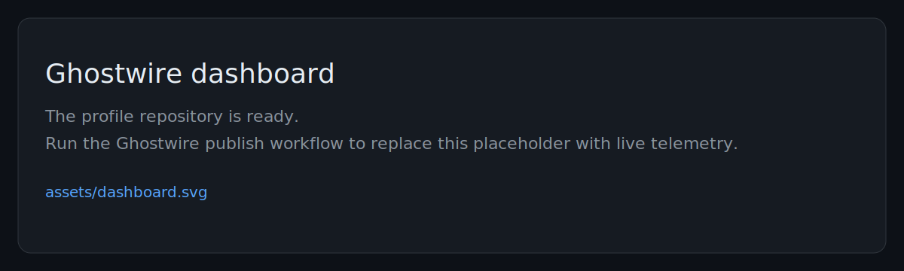

# rqdmap

I build developer tools, local-first systems, and AI-assisted workflows.

I am based in Beijing and currently at **BUAA**. Most of my recent work sits at the intersection of **CLI/TUI tooling**, **automation**, **personal infrastructure**, and **small systems that are easy to reason about and operate**.

**Links**: [Website](https://www.rqdmap.top/) · [Ghostwire](https://github.com/rqdmap/ghostwire) · [Dotfiles](https://github.com/rqdmap/dotfiles)

## Focus

- developer tooling and terminal-first workflows
- local-first software and personal infrastructure
- telemetry, observability, and operational simplicity
- AI-assisted coding systems built around explicit user control

## Selected projects

| Project | Description |
|---|---|
| [ghostwire](https://github.com/rqdmap/ghostwire) | Private telemetry pipeline for collecting local ActivityWatch and OpenCode usage, aggregating it on a private server, and publishing a sanitized dashboard. |
| [mimir](https://github.com/rqdmap/mimir) | Terminal UI for browsing and managing OpenCode sessions. |
| [lethe](https://github.com/rqdmap/lethe) | Persistent memory plugin for OpenCode, designed around reviewable, user-controlled memory updates. |
| [dotfiles](https://github.com/rqdmap/dotfiles) | Chezmoi-driven workstation setup for a terminal-centric development environment. |
| [Drawio-DualFontPlugin](https://github.com/rqdmap/Drawio-DualFontPlugin) | Draw.io plugin that improves mixed Chinese and English typography defaults. |

## Personal telemetry

The panel below is generated by **Ghostwire** from local ActivityWatch and OpenCode data, then published as a static SVG.

<picture>
  
</picture>

## Notes

I prefer systems with clear trust boundaries, file-backed or otherwise inspectable state, and operational paths that stay debuggable under failure. That bias shows up in most of the tooling here.
